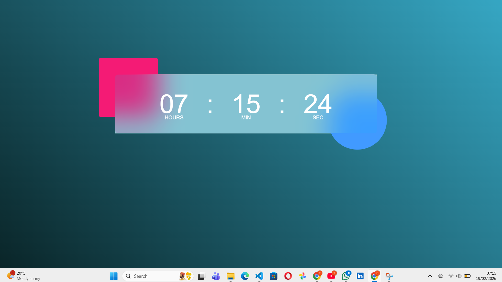

# 🕒 Digital Clock using JavaScript

A modern and responsive **Digital Clock** built using **HTML, CSS, and JavaScript**.  
This project displays real-time hours, minutes, and seconds with a stylish glassmorphism UI design.

## 🚀 Features
- ⏰ Real-time clock (updates every second)
- 🎨 Modern gradient background
- 🧊 Glassmorphism effect using backdrop-filter
- 📱 Responsive and centered layout
- 🧼 Clean and simple code structure

## 🛠️ Technologies Used
- HTML5
- CSS3 (Flexbox + Glassmorphism)
- JavaScript (Date object + setInterval)

## ⚙️ How It Works
- JavaScript's `Date()` object fetches the current time.
- `setInterval()` updates the clock every 1000ms (1 second).
- Leading zeros are added for single-digit values.
- CSS is used to create a modern glass UI effect.

## ▶️ How to Run
1. Download or clone the repository:
 git clone https://github.com/takundagorogodo/digital-clock.git
2. Open `index.html` in your browser.
3. Enjoy the live digital clock!

## 🎨 UI Design Concept
- Gradient background
- Decorative floating shapes using `::before` and `::after`
- Glassmorphism clock container
- Centered using Flexbox

## 💡 Future Improvements
- 🌙 Dark/Light mode toggle
- 🌎 Timezone selector
- 📅 Date display
- ⏳ 12-hour / 24-hour format switch
- 🎵 Add ticking sound option

## 📸 Preview

## 📄 License
This project is open source and free to use.

## 🙌 Author

  GOROGODO TAKUNDA

Created with ❤️ using HTML, CSS & JavaScript.

